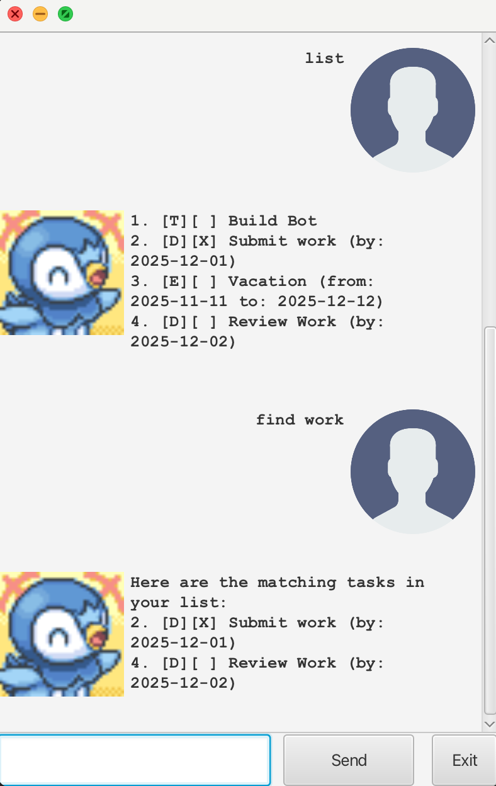

# Chirp User Guide


Simple Chatbot to help maintain list of tasks.

## Adding todos

Tasks with deadlines can be added where the deadline of the tasks are shown to remind you of when the task is due.

Example: `todo <description>`

```
> todo review book
------------------------------------------------------------
 Added task: [T][ ] review book
 Currently 1 in the task list.
------------------------------------------------------------
```

## Adding deadlines

Tasks with deadlines can be added where the deadline of the tasks are shown to remind you of when the task is due.

Example: `deadline <description> /by <deadline-date>`

Note: `<deadline-date>` must be in format of `yyyy-MM-dd format`

```
> deadline return book /by 2025-12-04
------------------------------------------------------------
 Added task: [D][ ] return book  (by: 2025-12-04)
 Currently 2 in the task list.
------------------------------------------------------------
```
## Adding events

Tasks with deadlines can be added where the deadline of the tasks are shown to remind you of when the task is due.

Example: `event <description> /from <start-date> /to <end-date>`

Note: `<start-date>` and `<end-date>` must be in format of `yyyy-MM-dd format`

```
> event lecture /from 2025-12-02 /to 2025-12-05
------------------------------------------------------------
 Added task: [E][ ] lecture (from: 2025-12-02 to: 2025-12-05)
 Currently 3 in the task list.
------------------------------------------------------------
```

## Marking tasks

You can also mark if your tasks are done or not yet done (1-indexed)

Example: `mark <task index>` or `unmark <task index>`

```
> mark 1
------------------------------------------------------------
 Modified task: [D][X] return book  (by: 2025-12-04)
------------------------------------------------------------
> unmark 1
------------------------------------------------------------
 Modified task: [D][ ] return book  (by: 2025-12-04)
------------------------------------------------------------
```

## Deleting tasks

You can delete tasks in the list (1-indexed)

Example: `delete <task index>`

```
> delete 1
------------------------------------------------------------
 Delete task: [T][ ] review book
 Currently 3 tasks in the task list.
------------------------------------------------------------
```

## List Tasks

You can also lists the current tasks in the list

Example: `list`

```
> list
-----------------------------------------------------------
1. [T][ ] review book
2. [D][ ] return notes (by: 2025-12-03)
3. [D][ ] return book (by: 2025-12-04)
4. [E][ ] lecture (from: 2025-12-02 to: 2025-12-05)
------------------------------------------------------------
```

## List Tasks by date

You can also lists the current tasks in the list with a date filter.

Example: `list /on <filter-date>`

Note: `<filter-date>` must be in format of `yyyy-MM-dd format`

```
> list /on 2025-12-03
-----------------------------------------------------------
1. [T][ ] review book
2. [D][ ] return notes (by: 2025-12-03)
4. [E][ ] lecture (from: 2025-12-02 to: 2025-12-05)
------------------------------------------------------------
```

## Find Tasks by substring

You can also lists the current tasks in the list which description contains a provided substring

Example: `find <substring>`

```
> find book
-----------------------------------------------------------
1. [T][ ] review book
3. [D][ ] return book (by: 2025-12-04)
------------------------------------------------------------
```

## Exit bot

Quit the conversation

Example: `bye`

```
> bye
------------------------------------------------------------
 Bye. Hope to see you again soon!
------------------------------------------------------------
```